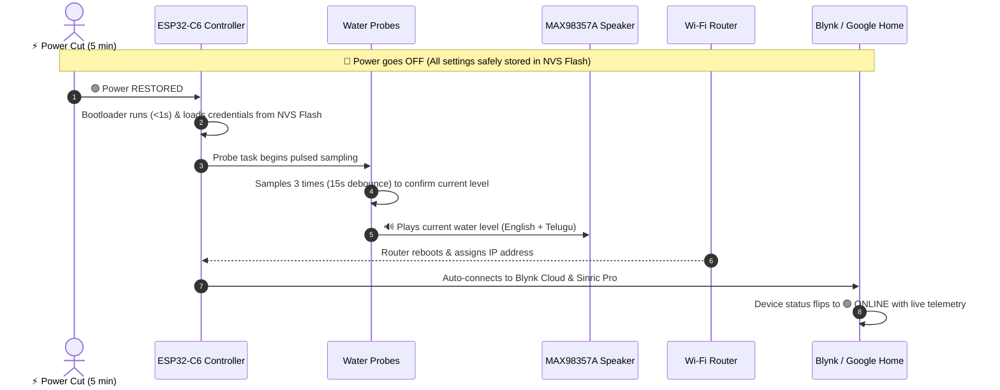
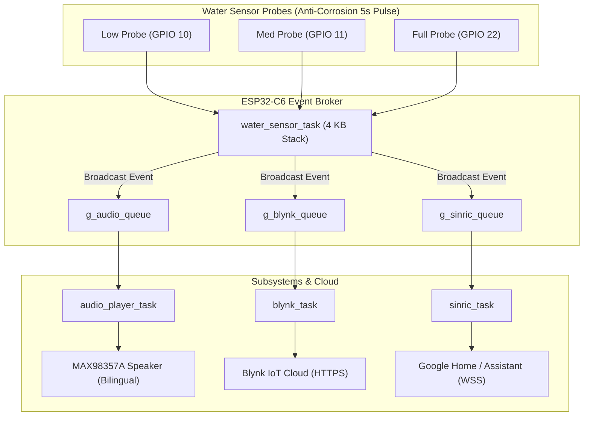

# 🌊 ESP32-C6 Commercial Smart Water Tank Monitor Firmware

An enterprise-grade, ultra-reliable IoT firmware designed for the **ESP32-C6 DevKitC-1 v1.2** platform. Features **MAX98357A I2S bilingual voice announcements (English + Telugu)**, **Anti-Corrosion Pulsed Strobe Sensing**, **Blynk IoT telemetry**, **Sinric Pro (Google Home / Assistant) integration**, and **Dual-Router Auto-Failover Wi-Fi**.

---

## 🌟 Key Features

- 🔊 **Bilingual Voice Announcements**: Real 16 kHz 16-bit PCM voice clips in **English** and **Telugu** played through MAX98357A I2S amplifier with +6 dB normalized loudness.
- 🛡️ **Anti-Corrosion Pulsed Sensing**: Reduces DC electrolysis corrosion by **5,000x** using 2ms strobe pulses every 10 seconds (0.02% duty cycle). Probes remain unpowered and floating 99.98% of the time.
- 🚦 **Dedicated Multi-Queue IPC**: Isolated FreeRTOS queues for Audio, Blynk, and Sinric Pro to eliminate task starvation and race conditions.
- ☁️ **Dual Cloud Synchronization**:
  - **Blynk IoT REST API**: Real-time water percentage, probe state indicators (`V0`–`V4`), and smart push notification filtering.
  - **Sinric Pro / Google Assistant**: WebSocket interface for native voice queries (*"Hey Google, what is the water level?"*).
- 📶 **Dual-Router Auto-Failover**: Automatically reconnects and switches between Primary (`railwirefibernet`) and Secondary (`BSNL Fiber`) with exponential backoff and jitter.
- ⚡ **Autonomous Power-Loss Recovery**: 100% automatic recovery after blackouts with NVS Flash persistence, router reboot delay tolerance, and instant level announcement.
- 🛡️ **Industrial Reliability**: Task Watchdog Timer (TWDT) with 15s panic reset, TLS Handshake Mutex for heap safety, and memory sanitization.

---

## 🔌 Hardware Pinout Table

| Peripheral / Sensor | Signal | ESP32-C6 Pin | Hardware Description |
|---|---|---|---|
| **Audio Amp (MAX98357A)** | BCLK | `GPIO 19` | I2S Bit Clock |
| **Audio Amp (MAX98357A)** | LRC / WS | `GPIO 18` | Left/Right Word Select |
| **Audio Amp (MAX98357A)** | DIN | `GPIO 20` | Audio Serial Data Line |
| **Water Level Probe** | Common Ref | **`GND`** | Fixed Reference Rod (Bottom, 3 cm) |
| **Water Level Probe** | Low (20%) | `GPIO 10` | Digital Input (Low level probe, 20 cm) |
| **Water Level Probe** | Medium (60%) | `GPIO 11` | Digital Input (Medium level probe, 55 cm) |
| **Water Level Probe** | Full (100%) | `GPIO 22` | Digital Input (Full level probe, 90 cm) |

---

## ⚡ Anti-Corrosion Strobe Sensing

### The Problem with Continuous DC Sensing:
Standard water level monitors keep pull-up resistors active 24/7. When submerged in conductive water, continuous DC current causes **electrochemical electrolysis**:
- **Anode (+3.3V, GPIO 10)**: Rapidly dissolves into green copper carbonate ($CuCO_3$).
- **Cathode (0V, GND)**: Forms white insulating mineral crust ($CaCO_3 / Mg(OH)_2$).

### The Solution (Firmware Pulsed Sensing):
```
TIME ────────────────────────────────────────────────────────►

Pull-up State:  █                                █
                ▏◄─ 2ms ON ─►                   ▏◄─ 2ms ON ─►
                ◄──────────── 10000ms (10s) ─────────────────►
                         ▲
                      9998ms OFF (0V, Floating)
                   (ZERO current, ZERO corrosion)
```

1. **Floating by Default**: GPIO pull-ups are completely disabled between reads.
2. **2ms Pulse**: Every 10 seconds, pull-ups activate for only 2 milliseconds to take a reading, then immediately shut off.
3. **99.98% Powerless**: Current duty cycle is reduced to **0.02%**, extending probe lifespan by **5,000x**.

---

## 🔬 Automated Probe Electrolysis & Fault Diagnostics

When a probe wire suffers from electrolysis corrosion, mineral crust insulation, or physical detachment, it creates an **impossible geometric combination** (e.g. `GPIO10=HIGH/DRY` while `GPIO11=LOW/WET` or `GPIO22=LOW/WET`).

The firmware includes an **Automated Hardware Diagnostic Engine** that analyzes the 3-bit bitmask, pinpoints the exact faulty probe, and announces specific bilingual voice warnings through the MAX98357A speaker:

| Bitmask (bin) | GPIO 10 (Low) | GPIO 11 (Med) | GPIO 22 (Full) | Diagnosis | Spoken Voice Announcement |
|---|---|---|---|---|---|
| `0b101` / `0b001` | **HIGH (Dry)** | **LOW (Wet)** | Any | 🚨 **Low Probe (GPIO 10) Open/Corroded** | *"Warning: Low water sensor probe 20 centimeter fault. Wire is disconnected or corroded. Please check probe one."* <br> *"హెచ్చరిక: 20 సెంటీమీటర్ల దిగువ నీటి సెన్సార్ పనిచేయడం లేదు. దయచేసి మొదటి వైరును తనిఖీ చేయండి."* |
| `0b010` | LOW (Wet) | **HIGH (Dry)** | **LOW (Wet)** | 🚨 **Med Probe (GPIO 11) Open/Corroded** | *"Warning: Medium water sensor probe 55 centimeter fault. Wire is disconnected or corroded. Please check probe two."* <br> *"హెచ్చరిక: 55 సెంటీమీటర్ల మధ్య నీటి సెన్సార్ పనిచేయడం లేదు. దయచేసి రెండవ వైరును తనిఖీ చేయండి."* |
| `0b011` | **HIGH (Dry)** | **HIGH (Dry)** | **LOW (Wet)** | 🚨 **GPIO 22 Short to GND / Multi-Probe Break** | *"Warning: Water sensor wiring fault. Please check sensor probes."* <br> *"హెచ్చరిక: వాటర్ సెన్సార్ వైరింగ్ లోపం. దయచేసి కనెక్షన్లను తనిఖీ చేయండి."* |

- **15-Second Splash Debounce**: Requires 3 consecutive 5-second samples before triggering, preventing water ripple false alarms.
- **Blynk IoT Alert**: Changes status label to `FAULT: Low Probe (GPIO10)` and sends an urgent hardware alert push notification.

---

## 🔄 Power Outage & Autonomous Auto-Recovery

The system is designed with **100% autonomous recovery**. If power is lost for any duration (e.g., 5 minutes or hours):



### Auto-Recovery Timeline:
1. **0–1 Seconds (Instant Boot)**: Bootloader starts, loads Wi-Fi credentials from Non-Volatile Flash (NVS), initializes I2S audio driver, FreeRTOS multi-queues, and Task Watchdog Timer.
2. **15 Seconds (Probe Stabilization)**: Sensor probes complete 3-sample debounce (5s × 3) and confirm the exact tank water level.
3. **Voice Announcement**: Speaker immediately announces the current level (*"Water Level Sixty One Percent"* / *"నీటి మట్టం అరవై ఒక్క శాతం ఉంది"*).

> [!IMPORTANT]
> ### 🌐 4. Wi-Fi & Cloud Auto-Reconnection (Zero-Intervention Reconnect)
>
> - **Router Reboot Delay Tolerance**: If your home Wi-Fi router takes **1–2 minutes** to restart after a power cut, the firmware's `wifi_manager` uses **exponential backoff with jitter** (`2s -> 4s -> 8s -> ... -> 60s ± 20%`) to continually retry in the background without freezing, blocking other tasks, or flooding the router.
>
> ---
>
> ### 🚀 **ONCE WI-FI IS CONNECTED — Automatic Cloud Orchestration:**
>
> The moment Wi-Fi establishes an IP address, the firmware signals `EVT_WIFI_CONNECTED` and automatically wakes both cloud subsystems simultaneously:
>
> 1. **🟢 Blynk IoT Cloud Synchronization**:
>    - Device status automatically flips to **`ONLINE`** on the Blynk mobile app & web dashboard.
>    - Virtual pins `V0`–`V4` immediately update with the real-time water percentage and probe states.
>    - **Spam Suppression**: The initial connection sync suppresses phone push notifications to prevent false alarm alerts when power returns.
>
> 2. **🗣️ Sinric Pro / Google Home Integration**:
>    - Secure WebSocket connection (`WSS`) automatically re-establishes with `ws.sinric.pro`.
>    - Performs cryptographic HMAC authentication and syncs live tank level with Google Cloud.
>    - Google Assistant integration is instantly ready for voice inquiries (*"Hey Google, what is the water level?"*).
>
> 3. **🛡️ Parallel TLS Handshake Safety (`g_tls_handshake_mutex`)**:
>    - Initializing HTTPS and WSS connections at the same time requires significant RAM. The firmware uses a hardware TLS Mutex to safely serialize the encryption handshakes, preventing heap fragmentation and ensuring zero crashes.
>
> ---
>
> ### 💡 **100% Offline Independence (No Wi-Fi Needed for Core Functions):**
> Even if your home Wi-Fi router is completely powered off or internet goes down:
> - Water level sensing (20%, 60%, 100%) continues unaffected.
> - MAX98357A bilingual voice announcements (**English + Telugu**) play locally at the tank with 100% reliability.
> - As soon as Wi-Fi returns, cloud synchronization resumes instantly with zero user action required.

---

## 🏗️ Project Directory Structure & File Guide

Below is the complete architectural layout of the project, followed by a beginner-friendly explanation of what every single folder and file does.

```text
esp32c6_max98357a_sine/
├── platformio.ini                  # PlatformIO target, flash, and upload configuration
├── partitions.csv                  # 6 MB Flash partition table definition
├── CMakeLists.txt                  # Root ESP-IDF project build script
├── generate_audio_clips.py         # Google TTS to 16 kHz PCM audio generator script
├── sdkconfig.defaults              # Default baseline ESP-IDF settings
├── main/                           # Application entry & lifecycle orchestrator
│   ├── CMakeLists.txt              # Build rules for the main component
│   ├── Kconfig.projbuild           # Menuconfig pin and hardware configuration options
│   ├── app_main.c                  # Master firmware orchestrator & task launcher
│   ├── app_main.h                  # Header for main orchestration lifecycle
│   ├── main.c                      # Standard ESP-IDF entry wrapper
│   └── sinric_ca.pem               # Root CA certificate for Google Home WSS validation
└── components/                     # Modular firmware subsystem components
    ├── drivers/                    # Hardware Abstraction Layer (HAL)
    │   ├── CMakeLists.txt          # Drivers component build rules
    │   ├── gpio_config.c / .h      # Probe pin configuration (anti-corrosion floating init)
    │   ├── water_sensor.c / .h     # 10s pulsed strobe sensing, bitmask logic & debounce
    │   ├── audio_player.c / .h     # MAX98357A I2S driver (+6 dB gain, bilingual queue player)
    │   └── audio/                  # Raw PCM voice data arrays
    │       ├── audio_clips.c       # Master 16 kHz 16-bit PCM voice clips (EN + TE + Faults)
    │       ├── tank_empty.h        # English: "Tank Empty" array definition
    │       ├── water_low.h         # English: "Water Level Low" array definition
    │       ├── water_medium.h      # English: "Water Level Sixty One Percent" array definition
    │       ├── tank_full.h         # English: "Tank Full" array definition
    │       ├── tank_empty_te.c/.h  # Telugu: "ట్యాంక్ ఖాళీగా ఉంది" array definition
    │       ├── water_low_te.c/.h   # Telugu: "నీటి మట్టం తక్కువగా ఉంది" array definition
    │       ├── water_medium_te.c/.h# Telugu: "నీటి మట్టం అరవై ఒక్క శాతం ఉంది" array definition
    │       └── tank_full_te.c/.h   # Telugu: "ట్యాంక్ నిండిపోయింది" array definition
    ├── cloud/                      # Network, Cloud & Voice Assistant Integrations
    │   ├── CMakeLists.txt          # Cloud component build rules
    │   ├── wifi_config.h           # Wi-Fi SSIDs, passwords, Blynk tokens, and Sinric keys
    │   ├── wifi_manager.c / .h     # Dual-router auto-failover with exponential backoff
    │   ├── wifi_prov.c / .h        # Encrypted NVS Flash Wi-Fi credential storage
    │   ├── blynk_client.c / .h     # Blynk IoT REST API client (V0–V4 virtual pins)
    │   └── sinric_client.c / .h    # Sinric Pro WebSocket client for Google Home voice queries
    └── services/                   # FreeRTOS IPC, Power Management & Telemetry
        ├── CMakeLists.txt          # Services component build rules
        ├── app_events.c / .h       # Dedicated FreeRTOS queue broker & TLS mutex
        ├── sys_diagnostics.c / .h  # Real-time health monitor (Heap RAM, RSSI, Uptime)
        └── night_sleep.c / .h      # Nighttime power manager (IST timezone)
```

---

### 📂 1. Root Directory (`/`)

* **[`platformio.ini`](file:///c:/Users/chara/.gemini/antigravity-ide/scratch/esp32c6_max98357a_sine/platformio.ini)**:
  The master build file for PlatformIO. Specifies the target chip (`ESP32-C6`), framework (`ESP-IDF v6.0.1`), serial monitor port and baud rate (`COM6` @ `115200`), upload speed (`460800`), 8 MB Flash size, and links the custom partition table (`partitions.csv`).
* **[`partitions.csv`](file:///c:/Users/chara/.gemini/antigravity-ide/scratch/esp32c6_max98357a_sine/partitions.csv)**:
  The Flash Memory Map for the ESP32-C6's 8 MB flash chip. Allocates **6 MB (`0x600000`)** for the main firmware application (`factory`) to comfortably fit the bilingual voice clips, 24 KB for Non-Volatile Storage (`nvs`), and 4 KB for RF Wi-Fi calibration (`phy_init`).
* **[`CMakeLists.txt`](file:///c:/Users/chara/.gemini/antigravity-ide/scratch/esp32c6_max98357a_sine/CMakeLists.txt)**:
  The root CMake build configuration that registers the ESP-IDF project (`esp32c6_water_monitor`) and imports all modular components.
* **[`generate_audio_clips.py`](file:///c:/Users/chara/.gemini/antigravity-ide/scratch/esp32c6_max98357a_sine/generate_audio_clips.py)**:
  A Python utility tool that uses Google Text-to-Speech (`gTTS`) and `ffmpeg` to generate real human voice clips in **English** and **Telugu**, converts them to 16 kHz 16-bit Mono raw PCM format, normalizes volume to +6 dB, and exports them directly into C arrays in `audio_clips.c`.
* **[`sdkconfig.defaults`](file:///c:/Users/chara/.gemini/antigravity-ide/scratch/esp32c6_max98357a_sine/sdkconfig.defaults)**:
  Defines project-wide ESP-IDF default options, such as enabling Mozilla SSL certificate bundles, configuring FreeRTOS tick rates, and setting stack sizes.

---

### 📂 2. `main/` — Application Lifecycle & Orchestration

* **[`main/app_main.c`](file:///c:/Users/chara/.gemini/antigravity-ide/scratch/esp32c6_max98357a_sine/main/app_main.c)**:
  The central nervous system of the firmware. It initializes the Task Watchdog Timer (15s timeout), sets up FreeRTOS inter-task communication queues, configures system event groups, and starts all background worker tasks (`water_sensor_task`, `audio_player_task`, `blynk_task`, `sinric_task`, `sys_diagnostics_task`). Once boot completes, it deletes itself to reclaim heap memory.
* **[`main/app_main.h`](file:///c:/Users/chara/.gemini/antigravity-ide/scratch/esp32c6_max98357a_sine/main/app_main.h)**:
  Header file providing the `app_main_run()` prototype and application lifecycle definitions.
* **[`main/main.c`](file:///c:/Users/chara/.gemini/antigravity-ide/scratch/esp32c6_max98357a_sine/main/main.c)**:
  The standard ESP-IDF entry function `app_main()` that invokes `app_main_run()`.
* **[`main/Kconfig.projbuild`](file:///c:/Users/chara/.gemini/antigravity-ide/scratch/esp32c6_max98357a_sine/main/Kconfig.projbuild)**:
  Provides menu-driven configuration options for `idf.py menuconfig`, setting default GPIO pins for the Low probe (10), Medium probe (11), Full probe (22), and MAX98357A I2S audio pins (18, 19, 20).
* **[`main/sinric_ca.pem`](file:///c:/Users/chara/.gemini/antigravity-ide/scratch/esp32c6_max98357a_sine/main/sinric_ca.pem)**:
  The Root Certificate Authority (CA) certificate used to verify the TLS/SSL security certificate of `ws.sinric.pro` during Google Home WebSocket handshakes.
* **[`main/CMakeLists.txt`](file:///c:/Users/chara/.gemini/antigravity-ide/scratch/esp32c6_max98357a_sine/main/CMakeLists.txt)**:
  Registers source files in `main/` and links component dependencies (`drivers`, `cloud`, `services`).

---

### 📂 3. `components/drivers/` — Hardware Sensors & Audio

This component directly interfaces with physical sensors and audio hardware:

* **[`components/drivers/gpio_config.c` & `.h`](file:///c:/Users/chara/.gemini/antigravity-ide/scratch/esp32c6_max98357a_sine/components/drivers/gpio_config.c)**:
  Configures the physical GPIO pins on the ESP32-C6. Sets `GPIO 10` (Low, 20cm), `GPIO 11` (Med, 55cm), and `GPIO 22` (Full, 90cm) into **floating input mode with pull-ups disabled** by default to completely prevent DC electrolysis current when the sensor is idle.
* **[`components/drivers/water_sensor.c` & `.h`](file:///c:/Users/chara/.gemini/antigravity-ide/scratch/esp32c6_max98357a_sine/components/drivers/water_sensor.c)**:
  The core water-sensing engine:
  1. **Anti-Corrosion Strobe**: Activates internal pull-ups for only **2 ms every 10 seconds** (0.02% duty cycle), takes a reading, and turns them off.
  2. **Truth Table Bitmask Analysis**: Analyzes the 3-bit GPIO state (`GPIO22:GPIO11:GPIO10`) to calculate exact water levels (0%, 22%, 61%, 100%).
  3. **Probe Fault Diagnostics**: Detects impossible combinations (e.g. `0b101`, `0b001`, `0b010`) to identify broken or corroded probes at 20 cm or 55 cm.
  4. **20-Second Debounce**: Requires 2 consecutive identical readings across 20 seconds to eliminate false triggers from water surface waves.
  5. **Event Broadcasting**: Posts confirmed level changes and fault alerts to `g_audio_queue`, `g_blynk_queue`, and `g_sinric_queue`.
* **[`components/drivers/audio_player.c` & `.h`](file:///c:/Users/chara/.gemini/antigravity-ide/scratch/esp32c6_max98357a_sine/components/drivers/audio_player.c)**:
  The I2S audio driver for the MAX98357A amplifier (using `GPIO 19` BCLK, `GPIO 18` LRC, `GPIO 20` DIN). Consumes events from `g_audio_queue`, fetches 16 kHz 16-bit PCM voice data from Flash, scales volume by +6 dB without clipping, and alternates between **English** and **Telugu** voice announcements.

#### 🎵 `components/drivers/audio/` (PCM Voice Data Subfolder)
* **[`audio_clips.c`](file:///c:/Users/chara/.gemini/antigravity-ide/scratch/esp32c6_max98357a_sine/components/drivers/audio/audio_clips.c)**:
  The master audio database compiled into Flash. Contains 10 raw 16 kHz 16-bit PCM audio arrays for normal level announcements (*"Tank Empty"*, *"Water Level Low"*, *"Water Level Sixty One Percent"*, *"Tank Full"*) and diagnostic hardware warnings in English and Telugu.
* **`tank_empty.h` / `water_low.h` / `water_medium.h` / `tank_full.h`**:
  Header files containing sample count definitions and extern declarations for English voice clips.
* **`tank_empty_te.c/.h` / `water_low_te.c/.h` / `water_medium_te.c/.h` / `tank_full_te.c/.h`**:
  Source and header files containing dedicated Telugu voice clips.

---

### 📂 4. `components/cloud/` — Wi-Fi, Blynk IoT & Google Home

This component handles wireless connectivity and cloud synchronization:

* **[`components/cloud/wifi_config.h`](file:///c:/Users/chara/.gemini/antigravity-ide/scratch/esp32c6_max98357a_sine/components/cloud/wifi_config.h)**:
  Stores configuration parameters including Primary Router credentials (`railwirefibernet`), Secondary Router credentials (`BSNL Fiber`), Blynk Device Auth Token, and Sinric Pro Device IDs.
* **[`components/cloud/wifi_manager.c` & `.h`](file:///c:/Users/chara/.gemini/antigravity-ide/scratch/esp32c6_max98357a_sine/components/cloud/wifi_manager.c)**:
  Dual-Router Auto-Failover Wi-Fi manager. Automatically connects to Router #1, fails over to Router #2 if unavailable, and uses exponential backoff with random jitter during power outages. Sets `EVT_WIFI_CONNECTED` once online.
* **[`components/cloud/wifi_prov.c` & `.h`](file:///c:/Users/chara/.gemini/antigravity-ide/scratch/esp32c6_max98357a_sine/components/cloud/wifi_prov.c)**:
  Manages Non-Volatile Storage (NVS) flash memory to securely read and write Wi-Fi credentials so the device reconnects automatically after any power cut.
* **[`components/cloud/blynk_client.c` & `.h`](file:///c:/Users/chara/.gemini/antigravity-ide/scratch/esp32c6_max98357a_sine/components/cloud/blynk_client.c)**:
  Blynk IoT REST API client. Sends encrypted HTTPS requests to update virtual pins `V0` (Status label), `V1` (Water percentage), `V2` (Low probe state), `V3` (Med probe state), and `V4` (Full probe state). Includes smart push notification filtering to prevent notification spam during routine 15s heartbeats.
* **[`components/cloud/sinric_client.c` & `.h`](file:///c:/Users/chara/.gemini/antigravity-ide/scratch/esp32c6_max98357a_sine/components/cloud/sinric_client.c)**:
  Sinric Pro WebSocket client. Opens a secure WSS connection to `ws.sinric.pro`, cryptographically signs data payloads using HMAC-SHA256, and responds to Google Assistant / Google Home voice queries (*"Hey Google, what is the water level?"*).

---

### 📂 5. `components/services/` — System Health & IPC Broker

This component provides background system services and FreeRTOS task coordination:

* **[`components/services/app_events.c` & `.h`](file:///c:/Users/chara/.gemini/antigravity-ide/scratch/esp32c6_max98357a_sine/components/services/app_events.c)**:
  The FreeRTOS Inter-Process Communication (IPC) Broker:
  1. Creates dedicated queues (`g_audio_queue`, `g_blynk_queue`, `g_sinric_queue`) so slow network connections never delay local audio announcements.
  2. Manages system event bits (`EVT_GPIO_READY`, `EVT_I2S_READY`, `EVT_WIFI_CONNECTED`, `EVT_SENSOR_FAULT`).
  3. Implements `g_tls_handshake_mutex` to serialize HTTPS and WSS cryptographic handshakes, preventing FreeRTOS heap starvation.
* **[`components/services/sys_diagnostics.c` & `.h`](file:///c:/Users/chara/.gemini/antigravity-ide/scratch/esp32c6_max98357a_sine/components/services/sys_diagnostics.c)**:
  Real-time system health monitor. Logs a structured diagnostic report every 60 seconds tracking Free RAM Heap, Minimum Free Heap (memory leak detection), Wi-Fi RSSI signal strength (in dBm), and system Uptime.
* **[`components/services/night_sleep.c` & `.h`](file:///c:/Users/chara/.gemini/antigravity-ide/scratch/esp32c6_max98357a_sine/components/services/night_sleep.c)**:
  Nighttime power manager configured for Indian Standard Time (IST). Suppresses non-critical audio alerts during quiet hours to conserve power and avoid disturbing household members.

---

## 🏛️ Event Broker Architecture



---

## 🚀 Building & Flashing

### Environment Requirements
- **PlatformIO**: Core v6.1+ with `espressif32` platform.
- **Framework**: ESP-IDF v6.0.1.

### Flash Firmware over COM Port
```powershell
pio run --environment esp32-c6-devkitc-1 --target upload
```

### Serial Monitor
```powershell
pio device monitor --port COM6 --baud 115200 --filter time
```

---

## 🛡️ Enterprise Reliability Highlights

1. **Task Watchdog Timer (TWDT)**: 15-second hardware watchdog on sensor and cloud tasks.
2. **TLS Handshake Mutex**: Serializes HTTPS/WSS handshakes to prevent FreeRTOS heap fragmentation.
3. **Smart Notification Throttling**: Restricts Blynk push notifications to true physical transitions, keeping 15-second heartbeats silent.
4. **Normalized Audio Output**: Audio samples scaled to 90% peak scale (+6 dB loudness boost) without digital clipping.
5. **NVS Non-Volatile Persistence**: Wi-Fi credentials, tokens, and configs survive indefinite power outages.
