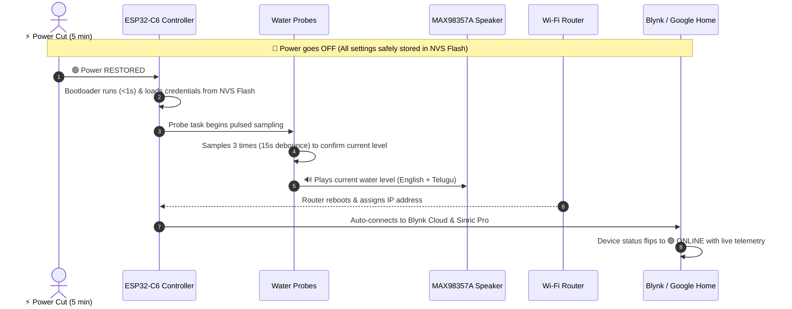
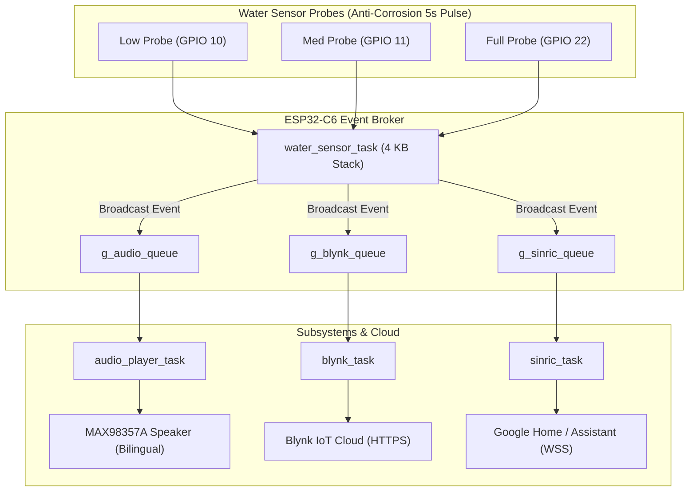

# 🌊 ESP32-C6 Commercial Smart Water Tank Monitor Firmware

An enterprise-grade, ultra-reliable IoT firmware designed for the **ESP32-C6 DevKitC-1 v1.2** platform. Features **MAX98357A I2S bilingual voice announcements (English + Telugu)**, **Anti-Corrosion Pulsed Strobe Sensing**, **Blynk IoT telemetry**, **Sinric Pro (Google Home / Assistant) integration**, and **Dual-Router Auto-Failover Wi-Fi**.

---

## 🌟 Key Features

- 🔊 **Bilingual Voice Announcements**: Real 16 kHz 16-bit PCM voice clips in **English** and **Telugu** played through MAX98357A I2S amplifier with +6 dB normalized loudness.
- 🛡️ **Anti-Corrosion Pulsed Sensing**: Reduces DC electrolysis corrosion by **2,500x** using 2ms strobe pulses every 5 seconds (0.04% duty cycle). Probes remain unpowered and floating 99.96% of the time.
- 🚦 **Dedicated Multi-Queue IPC**: Isolated FreeRTOS queues for Audio, Blynk, and Sinric Pro to eliminate task starvation and race conditions.
- ☁️ **Dual Cloud Synchronization**:
  - **Blynk IoT REST API**: Real-time water percentage, probe state indicators (`V0`–`V4`), and smart push notification filtering.
  - **Sinric Pro / Google Assistant**: WebSocket interface for native voice queries (*"Hey Google, what is the water level?"*).
- 📶 **Dual-Router Auto-Failover**: Automatically reconnects and switches between Primary (`railwirefibernet`) and Secondary (`BSNL Fiber`) with exponential backoff and jitter.
- ⚡ **Autonomous Power-Loss Recovery**: 100% automatic recovery after blackouts with NVS Flash persistence, router reboot delay tolerance, and instant level announcement.
- 🛡️ **Industrial Reliability**: Task Watchdog Timer (TWDT) with 15s panic reset, TLS Handshake Mutex for heap safety, and memory sanitization.

---

## 🔌 Hardware Pinout Table

| Peripheral / Sensor | Signal | ESP32-C6 Pin | Hardware Description |
|---|---|---|---|
| **Audio Amp (MAX98357A)** | BCLK | `GPIO 19` | I2S Bit Clock |
| **Audio Amp (MAX98357A)** | LRC / WS | `GPIO 18` | Left/Right Word Select |
| **Audio Amp (MAX98357A)** | DIN | `GPIO 20` | Audio Serial Data Line |
| **Water Level Probe** | Common Ref | **`GND`** | Fixed Reference Rod (Bottom, 3 cm) |
| **Water Level Probe** | Low (20%) | `GPIO 10` | Digital Input (Low level probe, 20 cm) |
| **Water Level Probe** | Medium (60%) | `GPIO 11` | Digital Input (Medium level probe, 55 cm) |
| **Water Level Probe** | Full (100%) | `GPIO 22` | Digital Input (Full level probe, 90 cm) |

---

## ⚡ Anti-Corrosion Strobe Sensing

### The Problem with Continuous DC Sensing:
Standard water level monitors keep pull-up resistors active 24/7. When submerged in conductive water, continuous DC current causes **electrochemical electrolysis**:
- **Anode (+3.3V, GPIO 10)**: Rapidly dissolves into green copper carbonate ($CuCO_3$).
- **Cathode (0V, GND)**: Forms white insulating mineral crust ($CaCO_3 / Mg(OH)_2$).

### The Solution (Firmware Pulsed Sensing):
```
TIME ────────────────────────────────────────────────────────►

Pull-up State:  █                                █
                ▏◄─ 2ms ON ─►                   ▏◄─ 2ms ON ─►
                ◄──────────── 5000ms (5s) ──────────────────►
                         ▲
                      4998ms OFF (0V, Floating)
                   (ZERO current, ZERO corrosion)
```

1. **Floating by Default**: GPIO pull-ups are completely disabled between reads.
2. **2ms Pulse**: Every 5 seconds, pull-ups activate for only 2 milliseconds to take a reading, then immediately shut off.
3. **99.96% Powerless**: Current duty cycle is reduced to **0.04%**, extending probe lifespan by **2,500x**.

---

## 🔄 Power Outage & Autonomous Auto-Recovery

The system is designed with **100% autonomous recovery**. If power is lost for any duration (e.g., 5 minutes or hours):



### Auto-Recovery Timeline:
1. **0–1 Seconds (Instant Boot)**: Bootloader starts, loads Wi-Fi credentials from Non-Volatile Flash (NVS), initializes I2S audio driver, FreeRTOS multi-queues, and Task Watchdog Timer.
2. **15 Seconds (Probe Stabilization)**: Sensor probes complete 3-sample debounce (5s × 3) and confirm the exact tank water level.
3. **Voice Announcement**: Speaker immediately announces the current level (*"Water Level Sixty One Percent"* / *"నీటి మట్టం అరవై ఒక్క శాతం ఉంది"*).

> [!IMPORTANT]
> ### 🌐 4. Wi-Fi & Cloud Auto-Reconnection (Zero-Intervention Reconnect)
>
> - **Router Reboot Delay Tolerance**: If your home Wi-Fi router takes **1–2 minutes** to restart after a power cut, the firmware's `wifi_manager` uses **exponential backoff with jitter** (`2s -> 4s -> 8s -> ... -> 60s ± 20%`) to continually retry in the background without freezing, blocking other tasks, or flooding the router.
>
> - **🟢 Blynk IoT Cloud Reconnect**:
>   - Device status automatically flips to **Online** on the Blynk mobile app & web dashboard.
>   - Virtual pins `V0`–`V4` immediately update with the real-time water percentage and probe states.
>   - **Spam Suppression**: The initial connection sync suppresses phone push notifications to prevent false alarm alerts when power returns.
>
> - **🗣️ Sinric Pro / Google Home Reconnect**:
>   - WebSocket connection automatically re-establishes with `ws.sinric.pro`.
>   - Google Assistant integration is instantly ready for voice inquiries (*"Hey Google, what is the water level?"*).

---

## 🏗️ Architecture & Component Layout

```text
esp32c6_max98357a_sine/
├── CMakeLists.txt              # Root build configuration
├── generate_audio_clips.py     # Google TTS to 16kHz PCM array generator
├── main/
│   ├── CMakeLists.txt
│   ├── Kconfig.projbuild       # idf.py menuconfig pin options
│   └── app_main.c / .h         # Subsystem lifecycle orchestrator
├── components/
│   ├── drivers/                # Hardware Abstraction Layer
│   │   ├── water_sensor.c/h    # Anti-corrosion pulsed polling & debounce (GPIO 10, 11, 22)
│   │   ├── audio_player.c/h    # MAX98357A I2S driver (GPIO 18, 19, 20)
│   │   ├── gpio_config.c/h     # Pinout configuration (floating init)
│   │   └── audio/              # PCM Telugu & English voice arrays
│   ├── cloud/                  # Network & Cloud Integrations
│   │   ├── wifi_manager.c/h    # Dual-router failover + exponential backoff
│   │   ├── wifi_prov.c/h       # Secure NVS credential manager
│   │   ├── blynk_client.c/h    # Blynk IoT REST client (V0-V4)
│   │   └── sinric_client.c/h   # Sinric Pro WebSocket client (Google Home)
│   └── services/               # System Services & Telemetry
│       ├── app_events.c/h      # Multi-queue broker, event groups, TLS mutex
│       ├── night_sleep.c/h     # Night sleep power manager (IST)
│       └── sys_diagnostics.c/h # Health metrics monitor (Heap, RSSI, Uptime)
```

---

## 🏛️ Event Broker Architecture



---

## 🚀 Building & Flashing

### Environment Requirements
- **PlatformIO**: Core v6.1+ with `espressif32` platform.
- **Framework**: ESP-IDF v6.0.1.

### Flash Firmware over COM Port
```powershell
pio run --environment esp32-c6-devkitc-1 --target upload
```

### Serial Monitor
```powershell
pio device monitor --port COM6 --baud 115200 --filter time
```

---

## 🛡️ Enterprise Reliability Highlights

1. **Task Watchdog Timer (TWDT)**: 15-second hardware watchdog on sensor and cloud tasks.
2. **TLS Handshake Mutex**: Serializes HTTPS/WSS handshakes to prevent FreeRTOS heap fragmentation.
3. **Smart Notification Throttling**: Restricts Blynk push notifications to true physical transitions, keeping 15-second heartbeats silent.
4. **Normalized Audio Output**: Audio samples scaled to 90% peak scale (+6 dB loudness boost) without digital clipping.
5. **NVS Non-Volatile Persistence**: Wi-Fi credentials, tokens, and configs survive indefinite power outages.
